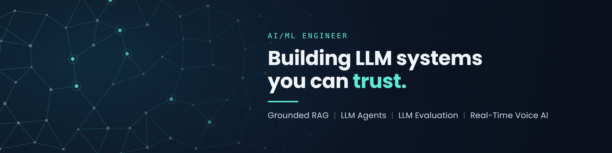

8

  

## Hi, I'm Venkat 👋

I'm an AI/ML Engineer who builds LLM systems that give answers people can check: retrieval-augmented generation that cites its sources, agents that use tools within safe limits, and real-time voice pipelines that start speaking before the model finishes generating.

I have an MS in Data Science from Florida State University and I'm based in New York.

### What I've built

- **Enterprise hybrid RAG:** a knowledge assistant over 25K+ documents that combines BM25 and dense-embedding search (Qdrant) on Google Cloud and Vertex AI. It improved Recall@K by ~18% and cut unsupported LLM answers by ~25%.
- **LLM agents and evaluation:** tool-using agent workflows, plus an evaluation framework across 500+ queries that measures groundedness, tool-execution correctness and latency.
- **Real-time voice AI:** a streaming pipeline from a local LLM to text-to-speech that reduced perceived response delay by ~25–30%.
- **Grounded RAG for a nonprofit:** a cited Q&A assistant over 300+ pages of internal PDFs with ~90%+ grounded-answer accuracy.
- **Predictive ML:** churn models that raised ROC-AUC from ~0.71 to ~0.80 and scored 500K+ customers per run.

### Featured work

| Project | What it is | Result |
|---|---|---|
| [**ConceptProbe**](https://www.kaggle.com/benchmarks/tasks/marneninagavenkat/conceptprobe-boolean-concept-learning/2) | A procedural benchmark that tests whether frontier LLMs learn new concepts or just recall familiar ones | 2,596 model evaluations; found a 0.373 gap between familiar and novel tasks |
| **Kaggle MAP** | Fine-tuned Qwen and Gemma (LoRA/PEFT) to classify student math misconceptions | 0.945 MAP@3 |

### Tech stack

**Languages and ML:** Python · SQL · PyTorch · Hugging Face Transformers · scikit-learn · XGBoost · Pandas · NumPy

**LLMs and retrieval:** LangChain · RAG · LLM Agents · Tool Calling · LoRA/PEFT · FAISS · Qdrant · BM25 · Hybrid Search

**Cloud and apps:** Google Cloud · Vertex AI · Streamlit · Async and Streaming Pipelines

### Get in touch

[LinkedIn](https://www.linkedin.com/in/naga-venkat-m-a67885202?utm_source=share_via&utm_content=profile&utm_medium=member_android) · [Kaggle](https://www.kaggle.com/marneninagavenkat) · [Email](mailto:marneninagavenkat1@gmail.com)

I'm open to AI/ML Engineer, GenAI Engineer and Data Scientist roles.
